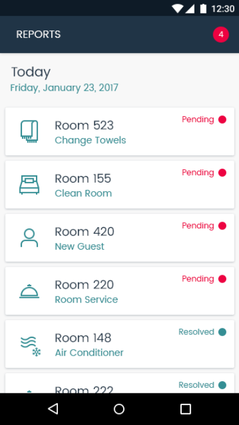

# SmartHotel360

During our **Connect(); 2017** event this year we presented beautiful app demos using Xamarin.

We are happy to announce the release of SmartHotel360. This release intends to share a simplified version of SmartHotel360 reference sample apps used at Connect(); 2017 Keynotes. If you missed it, you can watch <a href="https://channel9.msdn.com/Events/Connect/2017/K100">Scott Guthrie’s Keynote: Journey to the Intelligent Cloud in Channel 9</a>.

# SmartHotel360 Repos
For this reference app scenario, we built several consumer and line-of-business apps and an Azure backend. You can find all SmartHotel360 repos in the following locations:

* [SmartHotel360 ](https://github.com/Microsoft/SmartHotel360)
* [IoT Demo](https://github.com/Microsoft/SmartHotel360-IoT)
* [Backend Services (optimized for Kubernetes)](https://github.com/Microsoft/SmartHotel360-AKS-DevSpaces-Demo)
* [Public Website](https://github.com/Microsoft/SmartHotel360-public-web)
* [Pet Checker Serverless Function](https://github.com/Microsoft/SmartHotel360-PetCheckerFunction)
* [Mobile Apps](https://github.com/Microsoft/SmartHotel360-mobile-desktop-apps)
* [Sentiment Analysis](https://github.com/Microsoft/SmartHotel360-Sentiment-Analysis-App)
* [Migrating Internal apps to Azure](https://github.com/Microsoft/SmartHotel360-internal-booking-apps)
* [Original Backend Services](https://github.com/Microsoft/SmartHotel360-Azure-backend)

You can also download the mobile apps connected to our public endpoints in your devices following these links:

* [SmartHotel360 Android Client App](https://aka.ms/smarthotel360android) 
* [SmartHotel360 iOS Client App](https://aka.ms/smarthotel360ios) 
* [SmartHotel360 UWP Client App](https://aka.ms/smarthotel360uwp) 
* [SmartHotel360 NFC Android App](https://aka.ms/smarthotel360nfc) 
* [SmartHotel360 iOS Maintenance App](https://aka.ms/smarthotel360maintenance) 

**Note:** This document is about the apps using **Xamarin**.

Mobile and desktop apps we built for this reference sample include:

## SmartHotel360 Mobile and Desktop Apps
Travelers are always on the go, so SmartHotel360 offers a beautiful fully-native cross-device mobile app for guests and business travelers built with Xamarin. In this app guests and business travelers can book rooms and smart conference rooms as well as customize room temperature and lighting settings. The mobile app is available in iOS, Android, and Windows.

We also built a desktop app. This is a version of the SmartHotel360 Xamarin app. With this app, travelers can adjust the temperature and lighting settings of their rooms and find nearby recommended places to go, like coffee shops. All based on deeply personalized preferences.

## SmartHotel360 Maintenance App
For hotel managers and maintenance crew, we built a maintenance iOS app and used Xamarin Forms embedded. This is a great way to showcase how companies can modernize existing line-of-business apps with Xamarin. In this app, hotel managers and maintenance crew can get notifications of issues and resolve those directly from their mobile app.

## SmartHotel360 NFC
Travelers need quick access to their rooms. What if we can provide an automated way to have them go straight to their room when they get to the hotel? We used the power of mobile development with Android and NFC to provide this experience. We included NFC access from the SmartHotel360 traveler application and we also created a digital door application to check-in and open your room. All you need is to tap your phone on the digital door. No need to get a key from the lobby.

## Projects

There are three different solutions:

- **SmartHotel**: Main project developed with Xamarin.Forms.
- **SmartHotel Maintenance**: Xamarin.iOS Application that allows the maintenance of the hotel. It makes use of **[Xamarin.Forms Native Forms](https://blog.xamarin.com/unleashed-embedding-xamarin-forms-in-xamarin-native/)**.
- **SmartHotel NFC**: Unlock door using NFC.

## Supported Platforms: iOS, Android, and Windows

The SmartHotel app is available for three platforms:

- iOS
- Android
- Universal Windows Platform (UWP)

The SmartHotel Maintenance app is available only for iOS.

## Xamarin.Forms App (SmartHotel360)

Xamarin.Forms enables you to build native UIs for iOS, Android, macOS, Linux, and Windows from a single, shared codebase. You can dive into app development with Xamarin.Forms by following our [free self-guided learning from Xamarin University](https://university.xamarin.com/classes/track/self-guided). This project exercises the following patterns and features:

- Xamarin.Forms
- XAML UI
- Converters
- Custom Controls
- Custom Renderers
- Data Binding
- Effects
- Behaviors
- Custom Markup Extensions
- IoC
- Messaging Center
- MVVM
- Plugins for Xamarin
- Styles
- Phone and Tablet Layout
- Localization
- CSS
- VisualStateManager
- FlexLayout
- Xamarin UITests
- [Xamarin.Forms Native Forms](https://blog.xamarin.com/unleashed-embedding-xamarin-forms-in-xamarin-native/)
- [Xamarin Live Player](https://www.xamarin.com/live)
- [.NET Standard 2.0](https://github.com/dotnet/standard)

## Screens

**SmartHotel360 Mobile Apps**

   

 

**SmartHotel360 Maintenance**

**SmartHotel360 NFC**

## Sample endpoints
You can find the list of the sample endpoints in the following link: (http://sh360services-public.eastus2.cloudapp.azure.com/configuration-api/cfg/public-http).
To change the endpoints you can modifiy the AppSettings.cs file in the SmartHotel.Clients project under the Shared Code folder:
 

## Requirements

* [Visual Studio 2017 version 15.8 or Visual Studio for Mac version 7.6.3](https://www.visualstudio.com/vs/)
* Android Build Tools 27.0.3.
* Bing Maps Key - [Getting a Bing Maps Key](https://msdn.microsoft.com/en-us/library/ff428642.aspx)

## Demo Scripts
There is a detailed step-by-step demo script in the [demoscripts](https://github.com/Microsoft/SmartHotel360-mobile-desktop-apps/tree/master/DemoScripts) folder of this repo that you can use in your own presentations.

## IoT Demo - Coming Soon

1. In order to have live data working and enable room controls you must setup the [IoT Demo Backend](https://github.com/Microsoft/SmartHotel360-IoT)
2. Get `roomDevicesApiEndpoint` from the `userSettings.json` file, generated when setting up the IoT Demo in #1, and change the value of `defaultRoomDevicesEndpoint` in AppSettings.cs.
3. Get `room11SpaceId` from the `userSettings.json` file, generated when setting up the IoT Demo in #1, and change the value of `defaultRoomId` in AppSettings.cs.
4. Ensure that the property `defaultUseFakes` = false in AppSettings.cs

## Licenses

This project uses some third-party assets with a license that requires attribution:

- [Xamarin.Essentials](https://github.com/xamarin/Essentials)
- [MVVM Helpers](https://github.com/jamesmontemagno/mvvm-helpers): by James Montemagno
- [FFImageLoading](https://github.com/daniel-luberda/FFImageLoading): by Daniel Luberda
- [ACR User Dialogs](https://github.com/aritchie/userdialogs): by Allan Ritchie
- [Microcharts](https://github.com/aloisdeniel/Microcharts): by Aloïs Deniel
- [Rg.Plugin.Popup](https://github.com/rotorgames/Rg.Plugins.Popup): by Rotorgames
- [XamForms.Controls.Calendar](https://github.com/rebeccaXam/XamForms.Controls.Calendar): by RebeccaXam
- [Xamanimation](https://github.com/jsuarezruiz/Xamanimation): by Javier Suárez
- FiraSans Font: by Carrois Apostrophe (Fira Sans at Google Fonts)
- Poppins Font: by Indian Type Foundry (Poppins at Google Fonts)

## Code of Conduct

This project welcomes contributions and suggestions.  Most contributions require you to agree to a
Contributor License Agreement (CLA) declaring that you have the right to, and actually do, grant us
the rights to use your contribution. For details, visit https://cla.microsoft.com.

When you submit a pull request, a CLA-bot will automatically determine whether you need to provide
a CLA and decorate the PR appropriately (e.g., label, comment). Simply follow the instructions
provided by the bot. You will only need to do this once across all repos using our CLA.

This project has adopted the [Microsoft Open Source Code of Conduct](https://opensource.microsoft.com/codeofconduct/).
For more information see the [Code of Conduct FAQ](https://opensource.microsoft.com/codeofconduct/faq/) or
contact [opencode@microsoft.com](mailto:opencode@microsoft.com) with any additional questions or comments.
