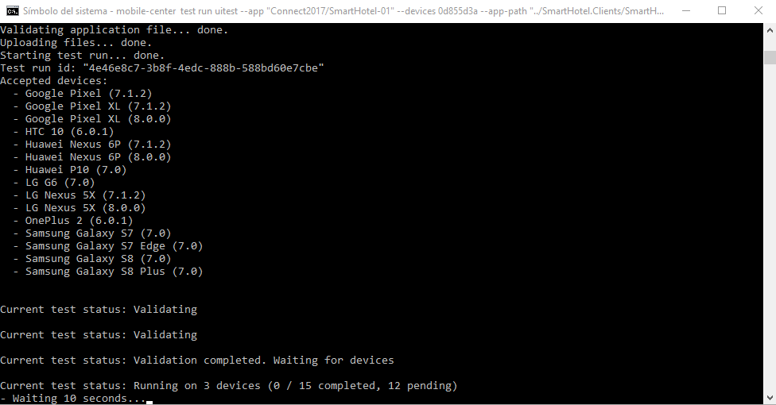
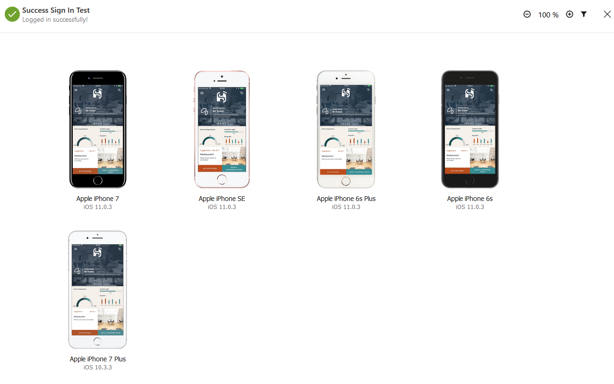

# Launch Xamarin.UITests in Mobile Center

To guarantee that the application works without problems on different devices, we have **Xamarin UITests**, Automated UI Acceptance Tests.

*How do we launch these tests in Mobile Center?*

## Prerequisites
In order to submit tests, you need to install Mobile Center Command Line Interface (CLI), version 0.2.1 or later.

1. Install [Node.js](https://nodejs.org/en/), version 6.3 or later.
2. Install the **mobile-center-cli** NPM package: 

    npm install -g mobile-center-cli

## Running tests

To run the tests in Mobile Center, run the following commands from the directory that contains the NuGet packages directory.

**Android**

    mobile-center test run uitest --app "Connect2017/SmartHotel-01" --devices 0d855d3a --app-path "../SmartHotel.Clients/SmartHotel.Clients.Android/bin/Release/com.microsoft.smarthotel.apk"  --test-series "launch-tests" --locale "en_US" --build-dir "../SmartHotel.Clients.UITests/bin/Release"

***NOTE**: 15 Devices.*

**iOS**

    mobile-center test run uitest --app "Connect2017/SmartHotel" --devices 054838d6 --app-path "../SmartHotel.Clients/SmartHotel.Clients.iOS/bin/iPhone/Release/SmartHotel.Clients.iOS.ipa"  --test-series "launch-tests" --locale "en_US" --build-dir "../SmartHotel.Clients.UITests/bin/Release"

***NOTE**: 15 Devices.*